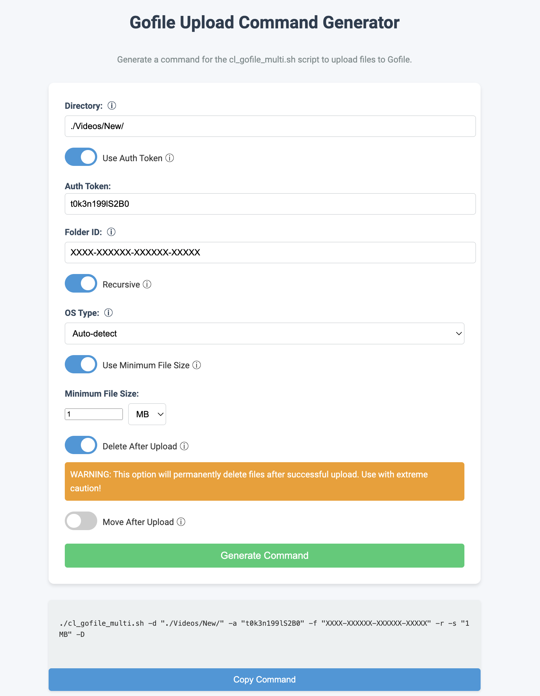

# GoFile Uploader

This repository contains a bash script and an HTML file for uploading files to GoFile, a free file sharing and storage service.

## Contents

1. `cl_gofile_multi.sh`: A Bash script for uploading multiple files to GoFile.
2. `index.html`: An HTML file for generating commands to use with the Bash script.

## Quick Start

1. Clone this repository or download the files.
2. Make the script executable:
   ```bash
   chmod +x cl_gofile_multi.sh
   ```
3. Set up your GoFile authentication token:
   ```bash
   ./cl_gofile_multi.sh -u
   ```
   This will prompt you to enter your GoFile authentication token and create a config file to store it.

4. You're now ready to use the script for uploading files!

## cl_gofile_multi.sh

This Bash script allows you to upload multiple files to GoFile with various options.

### Features

- Upload multiple files to GoFile
- Recursive directory scanning
- Custom folder ID support
- Progress tracking
- OS detection (macOS, Linux, Windows)
- Authentication token management
- Minimum file size filtering
- Option to delete files after successful upload
- Option to move files to a 'completed' folder after successful upload
- Sorting files by size before upload

### Screenshot



### Prerequisites

- Bash shell
- `curl`
- `jq` (for JSON parsing)

### Usage

```bash
./cl_gofile_multi.sh [-d directory] [-a auth_token] [-f folderid] [-r] [-o os_type] [-u] [-s min_size] [-D] [-m]
```

#### Options:

- `-d`: Specify the directory containing files to upload (default: "./")
- `-a`: Provide the GoFile authentication token
- `-f`: Specify the GoFile folder ID to upload to
- `-r`: Enable recursive directory scanning
- `-o`: Manually set the OS type (macos, linux, or windows)
- `-u`: Update the stored authentication token
- `-s`: Set minimum file size for upload (e.g., "1MB", "500KB")
- `-D`: Delete files after successful upload (use with caution!)
- `-m`: Move files to a 'completed' folder after successful upload

### Examples

1. Upload files from the current directory:
   ```bash
   ./cl_gofile_multi.sh
   ```

2. Upload files recursively from a specific directory:
   ```bash
   ./cl_gofile_multi.sh -d "/path/to/directory" -r
   ```

3. Upload files to a specific GoFile folder:
   ```bash
   ./cl_gofile_multi.sh -f "gofile_folder_id"
   ```

4. Update the stored authentication token:
   ```bash
   ./cl_gofile_multi.sh -u
   ```

5. Upload files larger than 5MB:
   ```bash
   ./cl_gofile_multi.sh -s "5MB"
   ```

6. Upload files and delete them after successful upload:
   ```bash
   ./cl_gofile_multi.sh -D
   ```

7. Upload files and move them to a 'completed' folder after successful upload:
   ```bash
   ./cl_gofile_multi.sh -m
   ```

## index.html

This HTML file provides a user-friendly interface for generating commands to use with the `cl_gofile_multi.sh` script.

### Features

- Input fields for directory, authentication token, and folder ID
- Toggle switches for recursive uploads and authentication token usage
- OS type selection
- Command generation based on user input
- Minimum file size option
- Delete after upload option (with warning)
- Move after upload option

### Usage

1. Open `index.html` in a web browser.
2. Fill in the desired options:
   - Directory: The path to the files you want to upload
   - Auth Token: Your GoFile authentication token
   - Folder ID: The ID of the GoFile folder to upload to
   - Recursive: Toggle on to include subdirectories
   - OS Type: Select your operating system or leave as auto-detect
3. Click "Generate Command" to create the appropriate command for `cl_gofile_multi.sh`.
4. Copy the generated command and run it in your terminal.

## Configuration

The script stores the authentication token in a configuration file:

- On Unix-like systems (macOS, Linux): `$HOME/.gofile_config`
- On Windows: `%USERPROFILE%\.gofile_config`

You can update this token using the `-u` option or by manually editing the file.

## Security Note

Keep your GoFile authentication token secure. Do not share it or commit it to public repositories.

## Limitations

- The script requires `jq` for JSON parsing.
- It excludes hidden files and files named 'SYNOINDEX_*'.
- The delete and move options should be used with caution, as they modify or remove files from your system.


## License

This project is licensed under the MIT License. See the [LICENSE](LICENSE) file in the repository for the full license text.

### MIT License Summary

- Permission is granted to use, copy, modify, merge, publish, distribute, sublicense, and/or sell copies of the software.
- The software is provided "as is", without warranty of any kind.
- The authors or copyright holders are not liable for any claims, damages, or other liability arising from the use of the software.

For more details on the MIT License, visit [opensource.org/licenses/MIT](https://opensource.org/licenses/MIT).

### Third-Party Libraries

This project uses the following third-party libraries, which may have their own licenses:

- `jq`: Used for JSON parsing. Licensed under the MIT License.
- `curl`: Used for making HTTP requests. Licensed under the curl License.

Please review the licenses of these libraries if you plan to use or distribute this software.

### Contributing

Contributions to this project are welcome. By contributing, you agree to license your contributions under the same MIT License that covers this project.
